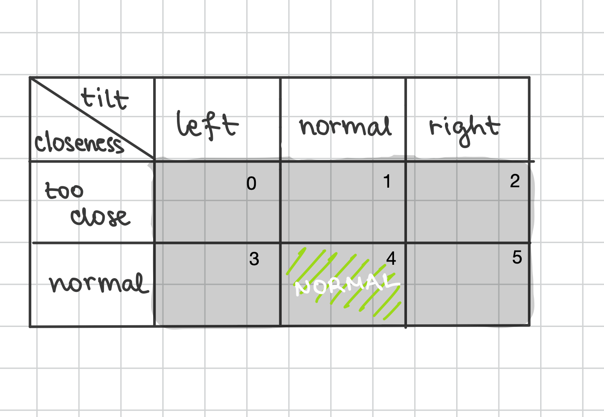

## WriteUpRight: personalization of the intervention strategies

### *Environment: (dependent on the user)*

**States:** two dimensions - **tilt** and **closeness** to the screen. 
- Along the **tilt** dimension, we have discretized the head roll angle to three possible values: *left*, *normal* and *right*. 
- Along the **closeness** dimension (*y* coordinate from the tablet) we can either have a *normal* distance or *too close* (below a certain threshold)

This forms a 2x3 state space, where the only valid posture that does not trigger the intervention is (normal, normal). 

**Actions:** **EC** and **EA**.
When the agent detects a bad posture it starts an intervention, either "Error Correction" (EC) or "Error Amplification" (EA). The goal is for the agent to determine the preference of the specific user, i.e. the intervention that corrects a persons posture better(the user returns to state 4).

**Reward system:**
If the agent succeeds to make the user return to the normal state within a given timeframe ($t_{timeout}$), it collects the reward of **+1**, otherwise it is penalized with a reward of **-1**.

**Non-episodic learning:** We start from Q values set to zero each time, this means that we don't learn anything from experiment to experiment.

#### Additional remarks:

**Transition matrix:** 
Besides two transition matrices corresponding to the movements from state to state when the agent is performing an action (intervention) of EA or EC, there is an additional matrix along the last dimension, which has probabilities of ending up in any state of the environment naturally, and it should model the stochasticity such as user moving randomly (without the intervention of the agent). We set the diagonal of the transition matrix to high values at the beginning (the user will probably not move from the current state if the agent does nothing), but as the experiment progresses, these probabilities get exponentially lower modeling the user's fatigue.

**Non-episodic learning:** Since in paper it is said: "We cannot draw a conclusive conclusion about whether children's understanding of the intervention strategy influences the effectiveness of the system. Further experiments are still required.", for now we do not simulate a single user doing the experiment multiple times.

### *Specificities of the user:*
- Transition matrix: Specifies the movements of a user from state to state (position) and is different for each user.
- "AHA" probability and factor of the EA intervention: When performing an EA intervention, the users posture becomes intentionally even worse, thus, the probability of a user to stay in it should be high. However, after some time, the user finds themself in an uncomfortable position and corrects it. We model this effect as an probability of the "AHA" moment to occur, when the user immediately changes the posture back to normal. Moreover, this probability increases with time, modeling the fact that the user ends up in a worse position as the EA intervention progresses and is more likely to understand that they should correct their posture.
- Fatigue parameter $\lambda$:
- Handedness of the user: 

### *Simulation:*  
Currently, our simulation runs as follows. We create an environment that is dependant on the user, i.e. transitions from state to state (natural and when applying an action) are dependant on the user and introduce stochasticity. The parameters also have an impact on the optimal action that is chosen for each state in the end. The environment transitions from an initial state using a "normal" transition matrix, i.e. without an intervention of the system, until bad posture is detected. Then, when we detect a bad-posture state, an action is chosen and the system begins applying an intervention(this is dependent on the learning algorithm chosen, on-policy with SARSA or off-policy with Q-Learning), i.e. the environment transitions w.r.t the transition matrix of a chosen intervention type. If the system manages to correct the posture within a certain timeframe ($t_{timeout}$), meaning that we detect the normal posture, it receives the reward of +1, otherwise, it receives a reward of -1, the system resets, a new action is chosen and begins to be applied. 

### *Proposal for future work:*
**Episodic learning:**  If we want to allow the user to do an experiment multiple times, i.e. episodic learning, we should save the Q-values after each experiment (episode) and start from these when running a new one for this user.  

**State machine for the simulation:**
Currently, our simulation is limited and does not accurately represent all the aspects of the real-world WriteUpRight experiment. A next step would be to construct a simulation state machine, with the following states:
- *Good posture*: The state of maintaining good posture.
- *Bad posture detected*: Detected a bad posture state of a user. We stay in this state for a certain amount of time (in the paper this is defined as a *grace period*) and proceed to the agent applying a certain intervention when the time passes and the user is still in bad posture state.
- *Intervention*: The state of applying an intervention. If we detect good posture, we proceed to *Posture improving*, if not we stay in the state until $t_{timeoout}$ runs out. If within a specified timeframe the posture does not improve, we receive a reward of -1, and get back to the *Bad posture detected* state.
- *Posture improving*: If we applied an intervention, and detect a good posture, we have to wait a certain amount of time and if the posture remains good, within that timeframe or $t_{timeout}$, we collect the reward of 1. If not, we return to the *Intervention* state.  
The described system can be represented with a diagram below:  

**The effect of fatigue on EC and EA interventions:** The effect of fatigue should also be incorporated in the transition matrices of EC and EA actions as a higher probability in staying in bad-posture states.
